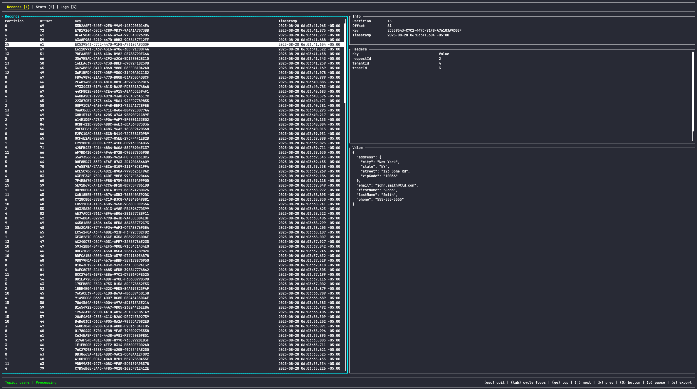
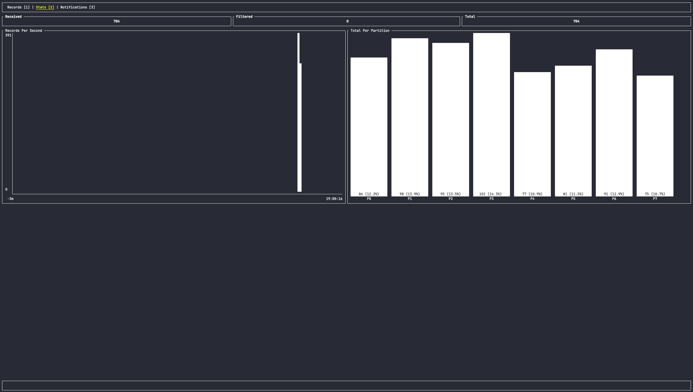
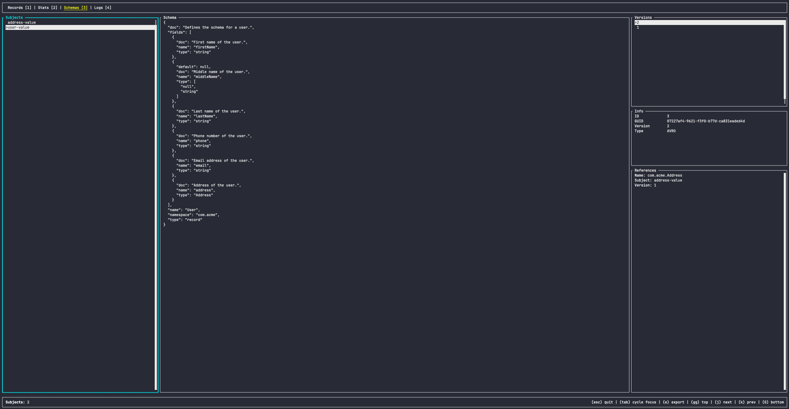
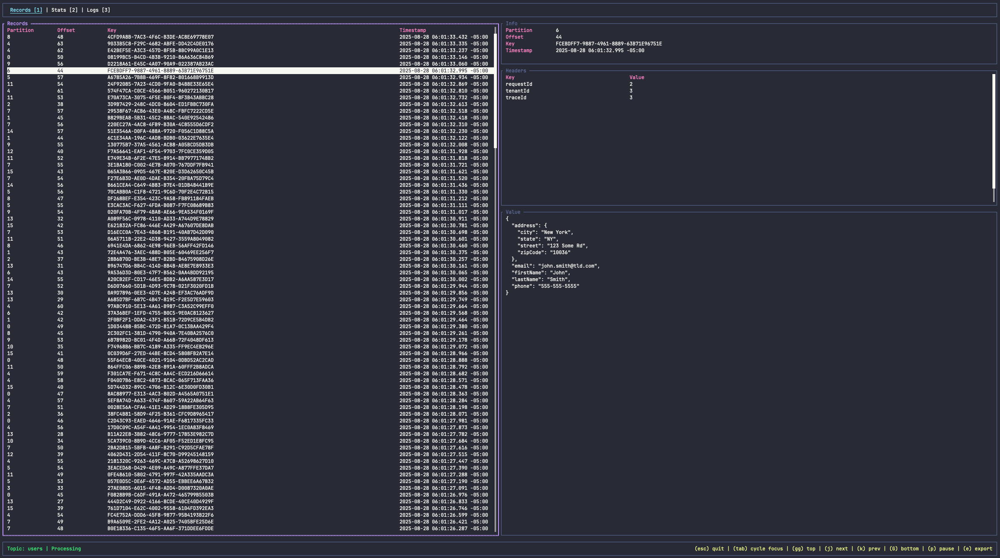
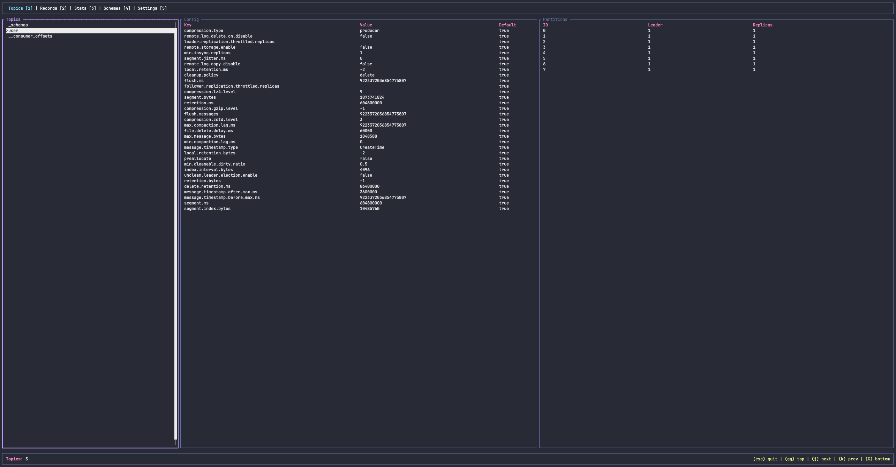
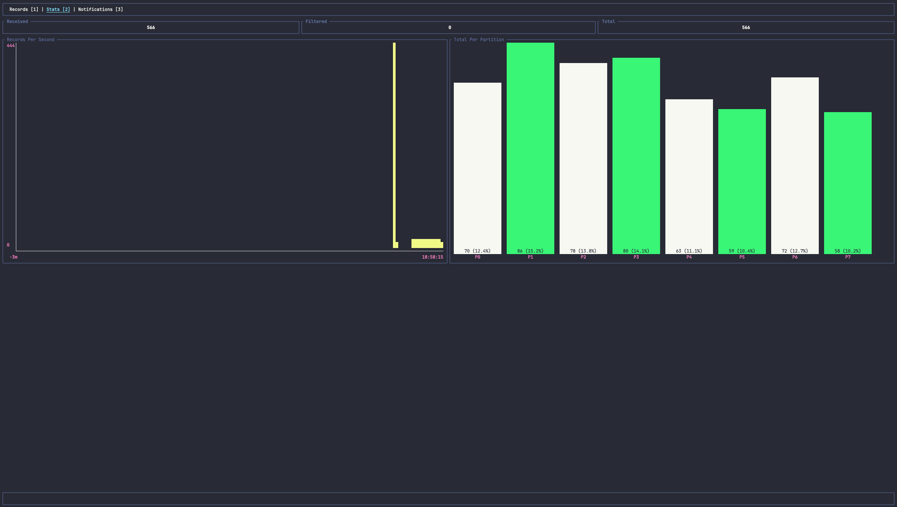
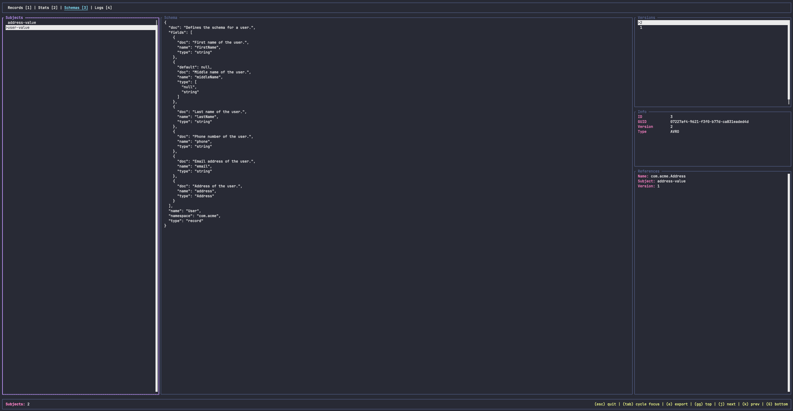

# kaftui

A TUI application which can be used to view records published to a [Kafka](https://kafka.apache.org/) topic.



The `kaftui` application provides the following features to users.

* View records from a topic including headers and payload value in an easy to read format.
* Pause and resume the Kafka consumer.
* Browse topics on the Kafka cluster and view their configuration.
* Assign all or specific partitions of the topic to the Kafka consumer.
* Seek to a specific offset on a single or multiple partitions of the topic.
* Export any record consumed to a file on disk.
* [Filter](#Filtering) out records the user may not be interested in using a JSONPath filter.
* Configure [profiles](#Profiles) to easily connect to different Kafka clusters.
* [Theme](#Theme) the application to match any existing terminal color scheme.
* Schema Registry integration for deserializing key and value data of records in `JSONSchema`, `Avro` and `Protobuf`
format.
* Schema browser for viewing subjects and their schemas within the application.
* Export schemas to a file on disk.

The application also keeps track of basic statistics during execution and presents them in a dedicated UI for the user.



The following statistics are currently tracked.
* Number of Kafka records received
* Number of Kafka records filtered
* Total number of Kafka records consumed
* Throughput in records per second.
* Number of Kafka records consumed per partition.
* Detailed per-partition information.

There is also a dedicated UI for browsing the topics available on the Kafka cluster along with their configuration
details and current partition information. When viewing the topics, the user can press the `/` key to filter the list
based on a starts with string match.


When using the schema registry, a subject browser will be available to the user as well where the subjects, their
schemas and the various versions of the schemas can be viewed and compared.



## Quick Start

First, install the `kaftui` application using `cargo`. The minimum required version of Rust is `1.89.0`.

```sh
> cargo install --git https://github.com/dustin10/kaftui.git
```

> Note that currently the `rdkafka` shared library is configured to be dynamically linked, so it should be installed
on the user's system before installation of the `kaftui` application. If you would like to statically link the `rdkafka`
library, then change the `dynamic-linking` feature to `static-linking` in the `Cargo.toml` file before building and
installing the application. If you would like to build the `rdkafka` library from source then change the value to
`cmake-build`. This option requires CMake to be installed. See the
[rdkafka-sys docs](https://github.com/fede1024/rust-rdkafka/tree/master/rdkafka-sys#features) for more details.

To simply view the topics available on the Kafka cluster, execute the `kaftui` command passing only the
`--bootstrap-servers` argument.

```sh
> kaftui --bootstrap-servers localhost:9092
```

To consume records from a topic, execute the application passing the `--bootstrap-servers` and `--topic` arguments.

```sh
> kaftui --bootstrap-servers localhost:9092 --topic orders
```

To use a custom group id for the consumer simply specify it using the `--group-id` argument.

```sh
> kaftui --bootstrap-servers localhost:9092 --topic orders --group-id tui-consumer
```

If the value in the Kafka records is in raw JSON format, i.e. **not** serialized using the schema registry, then simply
set the `--value-format` argument to `json` to have it pretty printed on display.

```sh
> kaftui --bootstrap-servers localhost:9092 --topic orders --value-format json
```

### Schema Registry

If the key and/or value of the Kafka records in the topic has been serialized into `JSONSchema`, `Avro` or `Protobuf`
format using the schema registry enabled serializers, i.e. the magic bytes are prepended to the record key or value
data, then specify the corresponding `--key-format` and/or `--value-format` argument along with the schema registry
connection details in order for the `kaftui` application to properly deserialize the records for display.

#### JSONSchema

```sh
> kaftui --bootstrap-servers localhost:9092 \
    --topic orders \
    --value-format json \
    --schema-registry-url http://localhost:8081
```

```sh
> kaftui --bootstrap-servers localhost:9092 \
    --topic orders \
    --key-format json \
    --value-format json \
    --schema-registry-url http://localhost:8081
```

#### Avro

```sh
> kaftui --bootstrap-servers localhost:9092 \
    --topic orders \
    --value-format avro \
    --schema-registry-url http://localhost:8081
```

```sh
> kaftui --bootstrap-servers localhost:9092 \
    --topic orders \
    --key-format avro \
    --value-format avro \
    --schema-registry-url http://localhost:8081
```

#### Protobuf

When consuming Protobuf encoded records, the `.proto` descriptor files that were used to serialize the records must
be made available to the application so that it can properly deserialize the records. The path to the directory
containing the `.proto` files must be specified using the `--protobuf-dir` argument. Additionally, the fully qualified
Protobuf message type that corresponds to the value of the records in the Kafka topic must be specified using the
`--value-protobuf-type` argument. If the partition key for the records is also encoded in Protobuf format, then the
`--key-format`, `--key-protobuf-type` arguments must also be specified.

```sh
> kaftui --bootstrap-servers localhost:9092 \
    --topic orders \
    --value-format protobuf \
    --schema-registry-url http://localhost:8081 \
    --protobuf-dir ./protos \
    --value-protobuf-type com.example.Order
```

```sh
> kaftui --bootstrap-servers localhost:9092 \
    --topic orders \
    --key-format protobuf \
    --value-format protobuf \
    --schema-registry-url http://localhost:8081 \
    --protobuf-dir ./protos \
    --key-protobuf-type com.example.OrderKey \
    --value-protobuf-type com.example.Order
```

## CLI Arguments

* `--bootstrap-servers, -b` - Host value used to set the bootstrap servers configuration for the Kafka consumer.
* `--topic, -t` - Name of the Kafka topic to consume records from. If no topic is specified, the application will start
up into the `Topics` UI allowing the user to browse the topics available on the Kafka cluster.
* `--partitions` - CSV of the partition numbers that the consumer should be assigned. This argument is used to restrict
the set of partitions that will be consumed. If not specified, all partitions will be assigned. For example, `0,2`
would cause only partitions `0` and `2` to be assigned to the Kafka consumer.
* `--schema-registry-url` - URL of the Schema Registry that should be used to deserialize and validate records from the
Kafka topic.
* `--schema-registry-bearer-token` - Bearer authentication token used to connect to the Schema Registry.
* `--schema-registry-user` - Basic authentication user used to connect to the Schema Registry.
* `--schema-registry-pass` - Basic authentication password used to connect to the Schema Registry.
* `--key-format, -k` - Specifies the format of the key contained in the Kafka topic. By default the value is assumed to
be in no special format and no special handling will be applied to it when displayed. Valid values: `json`, `avro` or
`protobuf`. If `avro` or `protobuf` is specified, then the `--schema-registry-url` argument is currently required.
* `--value-format, -v` - Specifies the format of the value contained in the Kafka topic. By default the value is assumed to
be in no special format and no special handling will be applied to it when displayed. Valid values: `json`, `avro` or
`protobuf`. If `avro` or `protobuf` is specified, then the `--schema-registry-url` argument is currently required.
* `--protobuf-dir` - Path to a directory that contains the `.proto` protobuf descriptor files that should be used to
deserialize protobuf encoded Kafka records. This argument is required when the `--value-format` argument is set to
`protobuf`.
* `--key-protobuf-type` - Fully qualified Protobuf message type that corresponds to the key of the records in the
Kafka topic. This argument is required when the `--value-format` argument is set to `protobuf`.
* `--value-protobuf-type` - Fully qualified Protobuf message type that corresponds to the value of the records in the
Kafka topic. This argument is required when the `--value-format` argument is set to `protobuf`.
* `--seek-to` - CSV of colon (`:`) separated pairs of partition and offset values that the Kafka consumer will seek to
before starting to consume records. For example, `0:42,1:10` would cause the consumer to seek to offset `42` on partition
`0` and offset `10` on partition `1`. A value of `reset` can also be specified for this argument which will cause the
consumer to seek to offset `0` for all partitions on the topic.
* `--group-id, -g` - Id for the consumer group that the application will use when consuming messages from the Kafka topic.
By default a group id will be generated from the hostname of the machine that is executing the application.
* `--filter, -f` - JSONPath filter that is applied to a record. Can be used to filter out any records from the Kafka
topic that the end user may not be interested in. A message will only be presented to the user if it matches the filter.
By default no filter is applied. See the [Filtering](#Filtering) section below for further details.
* `--profile, -p` - Specifies the name of pre-configured set of values that will be used as defaults for the execution
of the application. Profiles are stored in the `$HOME/.kaftui.json` file. Any other arguments specified when executing
the application will take precedence over the ones loaded from the profile. See the [Profiles](#Profiles) section below
for further details.
* `--consumer-properties` - Path to a `.properties` file containing additional configuration for the Kafka consumer
other than the bootstrap servers and group id. Typically used for configuring authentication, etc.
* `--max-records` - Maximum number of records that should be held in memory at any given time after being consumed from
the Kafka topic. Defaults to `256`.
* `--help, -h` - Prints the help text for the application to the terminal.

### Enabling Logs

Application logs can be enabled by specifying a value of `true` for the `KAFTUI_LOGS_ENABLED` environment variable when
running `kaftui`. When enabled, a `Logs` menu item will appear in the header that allows the user to view the logs in
the application. A `.json` file is also written to on disk that contains more verbose log information.

The `KAFTUI_LOGS_DIR` environment variable can be used to configure the directory that log files will be stored in. If
not set, the log files will be saved to the working directory.

## Key Bindings

There are some key bindings for the `kaftui` application which are global while others are dependent upon the screen
the user is currently viewing and the active widget within that screen. The following key bindings apply globally.

* `esc` - Exits the `kaftui` application.
* `tab` - Changes focus from the current widget to the next available one.

The number keys can be used to switch between the various screens available in the `kaftui` application. The following
screens are available to the user depending on the configuration used when executing the application.

* `Topics` - Displays the topics available on the Kafka cluster along with their configuration details.
* `Records` - Displays the records consumed from the Kafka topic.
* `Stats` - Displays basic statistics for the Kafka consumer.
* `Schemas` - Browse schemas in the schema registry. Only available when the schema registry has been configured.
* `Settings` - Displays the active configuration values being used by the application as well as configuration details
for any [profiles](#Profiles) that have been configured.
* `Logs` - Displays the logs produced by the application. Only available when logs have been enabled. These logs can
be useful when trying to debug issues with the application.

The active key bindings will be displayed in the UI on the right side of the footer and will vary depending on the 
screen that is currently being viewed within the application.

## Filtering

A filter can be specified using the `--filter` argument or in a profile, see below, to filter out any records consumed
from the Kafka topic that the user may not want to see. A filter is a JSONPath expression that is used to query the
filterable JSON representation of the Kafka record.

For example, the user may only want to view records for a specific tenant's data in the topic. If the `tenantId` is
specified as a header then the following command would accomplish this.

```sh
# only view records where tenantId header value is 42
> kaftui --bootstrap-servers localhost:9092 \
    --topic orders \
    --filter "$.headers[?(@.tenantId=='42')]"
```

As another example, the user may only want to view records that are on partition `0` of the topic. One way to do this
would be to use the `--filter` argument as shown below. A better way to accomplish this would be to use the `--partitions`
argument instead. See the [CLI Arguments](#CLI-Arguments) section for more details on that argument.

```sh
# only view records from partition 0
> kaftui --bootstrap-servers localhost:9092 \
    --topic orders \
    --filter "$.info[?(@.partition=='0')]"
```

## Profiles

A profile is a grouping of configuration values for the `kaftui` application. A user can setup as many profiles as
required to describe the default values that should be used when executing the application. Once a profile is configured,
then the `--profile` argument can be used to specify that it should be loaded at runtime.

The following properties are supported in profiles.

* `name` - Unique name that identifies the profile.
* `bootstrapServers` - Host value used to set the bootstrap servers configuration for the Kafka consumer.
* `topic` - Name of the Kafka topic to consume records from.
* `partitions` - CSV of partition numbers of the topic that should be assigned to the Kafka consumer.
* `schemaRegistryUrl` - URL of the Schema Registry that should be used to deserialize and validate records.
* `schemaRegistryBearerToken` - Bearer authentication token used to connect to the Schema Registry.
* `schemaRegistryUser` - Basic authentication user used to connect to the Schema Registry.
* `schemaRegistryPass` - Basic authentication password used to connect to the Schema Registry.
* `valueFormat` - Format the value of the records contained in the Kafka topic are encoded in.
* `protobufDir` - Path to a directory that contains the `.proto` files that should be used to deserialize protobuf
encoded Kafka records.
* `valueProtobufType` - Fully qualified Protobuf message type that corresponds to the value of the records in the Kafka
topic.
* `groupId` - Id of the group that the application will use when consuming messages from the Kafka topic.
* `filter` - JSONPath filter that is applied to a record.
* `consumerProperties` - Map of additional configuration for the Kafka consumer other than the bootstrap servers and
group id. Typically used for configuring authentication, etc.

See the [Persisted Configuration](#Persisted-Configuration) section below for how to configure profiles as well as a
few examples.

Once a profile has been configured, the profile name can simply be passed to the application using the `--profile`
argument rather than specifying all the individual configuration values on the command line.

```sh
> kaftui --profile local-orders-proto
```

## Theme

The `kaftui` application has support for themes. The theme is specified in the `$HOME/.kaftui.json` file. The following
properties are available to be configured using a theme.

* `panelBorderColor` - Default border color for a widget.
* `selectedPanelBorderColor` - Border color for the currently selected widget.
* `statusTextColorProcessing` - Color of the status text in the footer when the Kafka consumer is processing records.
* `statusTextColorPaused` - Color of the status text in the footer when the Kafka consumer is paused.
* `keyBindingsTextColor` - Color of the key bindings text in the footer.
* `labelColor` - Color of the widget labels, e.g. table header text.
* `highlightedTextColor` - Color used for text when the user's attention should be drawn to it, e.g. non-default topic
configuration values. 
* `recordListTextColor` - Color of the rows in the record list table.
* `recordInfoTextColor` - Color of the record properties text in the record info table.
* `recordHeadersTextColor` - Color of the record headers text in the record headers table.
* `recordValueTextColor` - Color of the record value text.
* `navColor` - Color of the navigation items.
* `menuItemTextColor` - Color of the selected menu items.
* `selectedMenuItemTextColor` - Color of the currently selected menu item.
* `notificationTextColorSuccess` - Color of the notification message text for a successful action.
* `notificationTextColorWarn` - Color of the notification message text for an action that produces a warning.
* `notificationTextColorFailure` - Color of the error notification message text for a failed action.
* `statsTextColor` - Color used for the text in the stats UI.
* `statsBarColor` - Primary color used for bars in a bar graph in the stats UI.
* `statsBarSecondaryColor` - Secondary color used for bars in a bar graph in the stats UI.
* `statsThroughputColor` - Color used for the throughput chart in the stats UI.

> Colors must be specified in RGB format **with** the leading `#`. See the [Persisted Configuration](#Persisted-Configuration)
section for an example of a theme.

The screenshot below is an example of a `kaftui` theme configuration that is inspired by the Dracula theme.









## Persisted Configuration

To persist configuration across executions of the `kaftui` application, a JSON configuration file can be saved at
`$HOME/.kaftui.json` which contains the relevant configuration values. The JSON below contains a full example of the
set of values that are available to configure the application from this file.

```json
{
  "scrollFactor": 3,
  "exportDirectory": ".",
  "maxRecords": 256,
  "profiles": [{
    "name": "local",
    "bootstrapServers": "localhost:9092"
  }, {
    "name": "local-filtered",
    "bootstrapServers": "localhost:9092",
    "filter": "$.headers[?(@.tenantId=='42')]"
  }, {
    "name": "cloud",
    "bootstrapServers": "kafka-brokers.acme.com:9092",
    "consumerProperties": {
      "security.protocol": "SASL_SSL",
      "sasl.mechanisms": "PLAIN",
      "sasl.username": "<username>",
      "sasl.password": "<password>"
    },
    "valueFormat": "json"
  }, {
    "name": "cloud-user-avro",
    "bootstrapServers": "kafka-brokers.acme.com:9092",
    "topic": "user",
    "valueFormat": "avro",
    "schemaRegistryUrl": "https://schema-registry.acme.com:8081",
    "schemaRegistryUser": "<basic-auth-user>",
    "schemaRegistryPass": "<basic-auth-pass>",
    "consumerProperties": {
      "security.protocol": "SASL_SSL",
      "sasl.mechanisms": "PLAIN",
      "sasl.username": "<username>",
      "sasl.password": "<password>"
    }
  }, {
    "name": "cloud-user-proto",
    "bootstrapServers": "kafka-brokers.acme.com:9092",
    "topic": "user",
    "keyFormat": "protobuf",
    "valueFormat": "protobuf",
    "protobufDir": "./protos",
    "keyProtobufType": "com.example.UserKey",
    "valueProtobufType": "com.example.User",
    "schemaRegistryUrl": "https://schema-registry.acme.com:8081",
    "schemaRegistryUser": "<basic-auth-user>",
    "schemaRegistryPass": "<basic-auth-pass>",
    "consumerProperties": {
      "security.protocol": "SASL_SSL",
      "sasl.mechanisms": "PLAIN",
      "sasl.username": "<username>",
      "sasl.password": "<password>"
    }
  }],
  "theme": {
    "panelBorderColor": "#6272A4",
    "selectedPanelBorderColor": "#BD93F9",
    "statusTextColorPaused": "#FF5555",
    "statusTextColorProcessing": "#50FA7B",
    "keyBindingsTextColor": "#F1FA8C",
    "labelColor": "#FF79C6",
    "highlightedTextColor": "#BD93F9",
    "recordListTextColor": "#F8F8F2",
    "recordInfoTextColor": "#F8F8F2",
    "recordHeadersTextColor": "#F8F8F2",
    "recordValueTextColor": "#F8F8F2",
    "menuItemTextColor": "#F8F8F2",
    "selectedMenuItemTextColor": "#8BE9FD",
    "notificationTextColorSuccess": "#F8F8F2",
    "notificationTextColorWarn": "#F1FA8C",
    "notificationTextColorFailure": "#FF5555",
    "statsTextColor": "#F8F8F2",
    "statsBarColor": "#F8F8F2",
    "statsBarSecondaryColor": "#50FA7B",
    "statsThroughputColor": "#FFB86C"
  }
}
```

Most of the available configuration above was discussed in previous sections. The list below outlines the rest.

* `scrollFactor` - Determines the number of lines to scroll the text area panels in the UI with each keypress.
* `exportDirectory` - Specifies the directory on the file system where exported records should be saved.
* `maxRecords` - Maximum number of records that should be held in memory at any given time after being consumed from
the Kafka topic.

